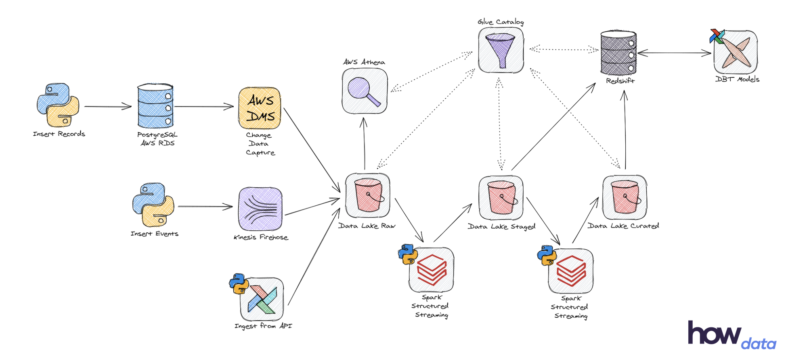

# Advanced Data Engineering Bootcamp

This repo was created to store the code produced during [How Bootcamps' Advanced Data Engineering Bootcamp](https://learn.howedu.com.br/turma/engenharia-de-dados/online). This bootcamp covers [Infrastructure as Code (IaC)](https://en.wikipedia.org/wiki/Infrastructure_as_code), especifically for [AWS](https://aws.amazon.com/)'s [CloudFormation](https://aws.amazon.com/cloudformation/) and [CDK](https://aws.amazon.com/cdk/).

## Final Project

